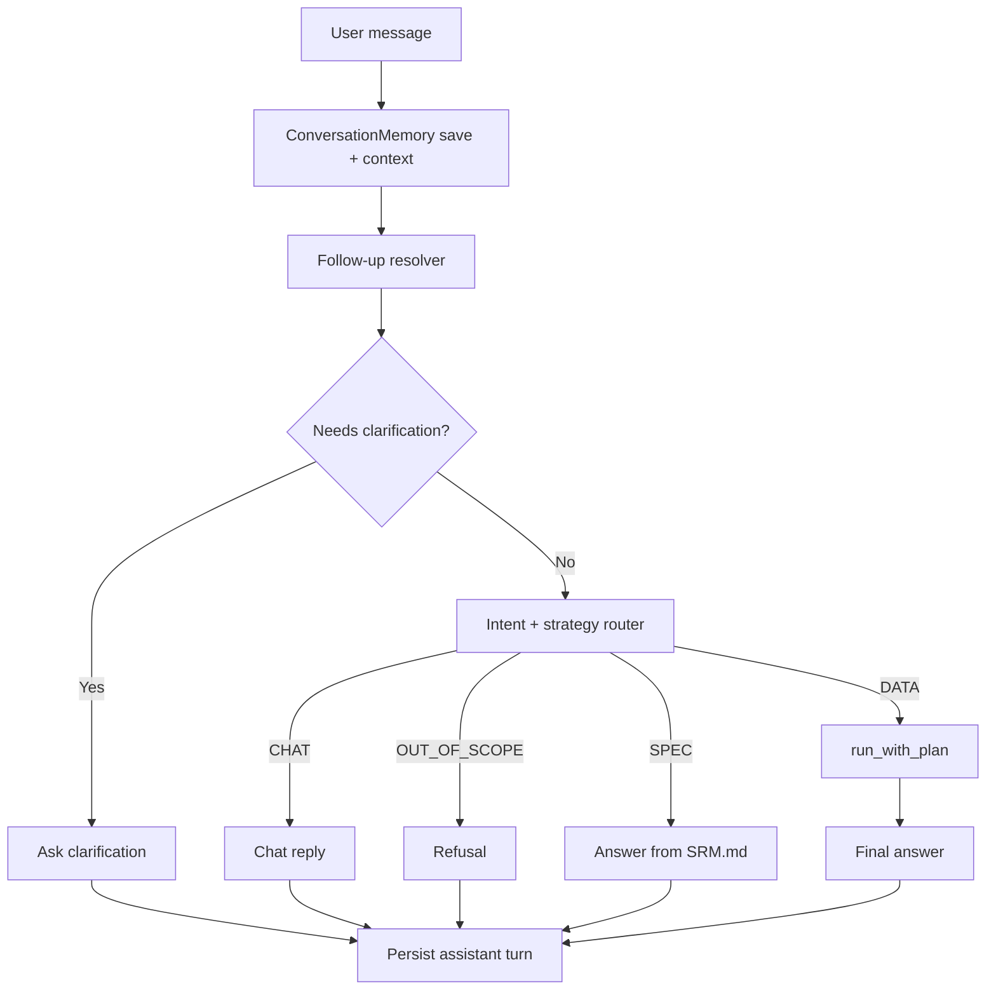
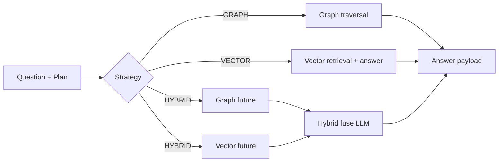

# SR-GraphRAG (SRM)

GraphRAG assistant for the SEMIC Semantic Registry Model (SRM), with:
- Neo4j + n10s RDF ingestion from TTL
- Prompt-driven routing (`GRAPH` / `VECTOR` / `HYBRID`) plus follow-up `CHAT` mode
- Chainlit UI and FastAPI backend with streaming events

## Entrypoints

- `graph_rag/main.py`: FastAPI app entrypoint
- `graph_rag/main_chainlit.py`: Chainlit runtime app entrypoint
- `graph_rag/setup/setup.py`: setup/ingestion entrypoint (`KnowledgeGraphIngestion.run_ingestion()`)
- `graph_rag/setup/ingestion.py`: ingestion + embedding/index pipeline implementation
- `graph_rag/setup/bootstrap_backend.py`: Docker startup bootstrap (wait Neo4j -> ingest -> verify)

## Runtime Flow
Current request flow in `graph_rag/api/service.py` (used by both API and Chainlit):


1. Save user turn in per-session memory.
2. Build recent conversation context.
3. Resolve follow-up to standalone question (`resolve_user_question`) when context exists.
4. If clarification is required, ask and stop.
5. Classify + plan route in one call (`classify_and_plan_route`), with `allow_chat=resolved.detected_follow_up`.
6. Handle intent:
   - `CHAT`: context-only answer (no retrieval), allowed only for follow-up turns
   - `OUT_OF_SCOPE`: refusal
   - `SPEC`: answer from `SRM.md`
   - `DATA`: execute `GRAPH` / `VECTOR` / `HYBRID`
7. Emit streaming events (`status`, `routing`, `debug`, `final`/`error`) and persist assistant turn.



## API Endpoints

Base router: `graph_rag/api/router.py` (`/api/chat`)

- `POST /api/chat/session`: returns `{session_id, welcome_message, suggested_prompts}`
- `POST /api/chat`: one-shot JSON response
- `POST /api/chat/stream`: SSE stream with intermediate events
- `GET /health`: API liveness
- `GET /health/ready`: readiness (Neo4j connected + non-zero ingested nodes)

## Route Execution

`graph_rag/router/graph_strategy_router.py`:

- `GRAPH`: runs graph traversal query path (`run_graph_traversal_query`)
- `VECTOR`: runs vector retrieval + vector final-answer generation
- `HYBRID`: runs graph and vector in parallel, then fuses both outputs with one final LLM call
- `OUT_OF_SCOPE`: fixed SRM-only refusal



## Graph Traversal + Retry

Graph path (`graph_rag/traversal/graph_traversal.py`):

- Uses a cached singleton `GraphCypherQAChain`
- Runs `invoke_with_repair(..., max_attempts=3)`
- Extracts generated Cypher from intermediate steps
- Builds final user answer from graph context with `SRM_GRAPH_FINAL_PROMPT`

Retry loop (`graph_rag/traversal/retry/retry_loop.py`):

- On Cypher failure, retries with repair instructions including previous query + Neo4j error
- Validates generated query and payload shape
- Empty result sets are retried up to max attempts, then returned as `no_results`
- Hard failures raise `GraphRetryExhaustedError` with per-round diagnostics
- Chat service catches traversal retry failures and returns user-facing fallback/error events instead of crashing UI/API loops.

## Ingestion Pipeline

Setup entrypoint:

```bash
python -m graph_rag.setup.setup
```

Pipeline in `graph_rag/setup/ingestion.py` (default `USE_RDF_GRAPH_ONLY = True`):

1. Load env and validate Neo4j/PWC credentials
2. Connect to Neo4j
3. Ensure n10s uniqueness constraint + graph config
4. Import TTL files via `n10s.rdf.import.inline` (default order: `data_SRM.ttl`, `enriched_SRM.ttl`)
5. Seed session IDs from imported graph
6. Create embeddings and vector indexes
7. Verify embedding/index results

## Configuration

### Runtime models (`config.py`)
- `LLM_MODEL_OPUS`: primary model for final answers
- `LLM_MODEL_GPT_MINI`: fast model for resolver/router tasks
- `EMBEDDING_MODEL`: embeddings model
- Credentials: `PWC_API_KEY`, `PWC_URL`

### Runtime UX knobs (`graph_rag/main.py`)
- `GRAPH_RAG_DEBUG_UI` (default `true`)
- `GRAPH_RAG_MAX_CONTEXT_TOKENS` (default `12000`)
- `GRAPH_RAG_RESPONSE_RESERVE_TOKENS` (default `2000`)
- `GRAPH_RAG_RECENT_TURNS_LIMIT` (default `8`)

### Neo4j connection
- Runtime graph modules read Neo4j from environment-backed `config.py` values.
- Setup/ingestion validates `NEO4J_URI`, `NEO4J_USERNAME`, `NEO4J_PASSWORD` from environment.

## Run

Install dependencies:

```bash
pip install -r requirements.txt
```

### Standalone Chainlit test mode

```bash
chainlit run graph_rag/main_chainlit.py -w
```

Use this when you want to test the assistant interactively without frontend integration.

### FastAPI backend mode

```bash
uvicorn graph_rag.main:app --reload --port 8000
```

Use this when connecting a custom frontend.

Important:
- `graph_rag/main_chainlit.py` is a Chainlit script (run with `chainlit run`).
- `graph_rag/main.py` is the ASGI app (run with `uvicorn graph_rag.main:app`).

### API quickstart

1. Create session:
   - `POST /api/chat/session`
2. Send one-shot message:
   - `POST /api/chat`
3. Or stream events:
   - `POST /api/chat/stream` (SSE: `status`, `routing`, `debug`, `final`, `error`)

Docker Compose (Neo4j + chatbot bootstrap):

```bash
docker compose up --build
```

`chatbot` container startup flow:
1. Wait until Neo4j is reachable
2. Run ingestion (`python -m graph_rag.setup.bootstrap_backend` -> `graph_rag.setup.setup`)
3. Verify graph has ingested data (`MATCH (n) RETURN count(n)`)
4. Start FastAPI on port `8050`

## Project Structure

```text
SR-GraphRAG/
  graph_rag/
    main.py                      # FastAPI app entrypoint
    main_chainlit.py             # Chainlit standalone test runtime
    prompts.py                   # Runtime prompts (router, Cypher generation, hybrid/spec/chat/follow-up)
    api/
      dto.py                     # API DTOs
      router.py                  # FastAPI routes (/api/chat/*)
      service.py                 # Chat orchestration + streaming events
    vector_search.py             # Vector retrieval + traversal helper
    router/
      graph_strategy_router.py   # Strategy execution (GRAPH/VECTOR/HYBRID)
      question_router.py         # Intent + plan classification + SPEC/CHAT QA helpers
    traversal/
      graph_traversal.py         # GraphCypherQAChain orchestration
      retry/retry_loop.py        # Cypher repair retry logic
    setup/
      setup.py                   # Setup entrypoint
      ingestion.py               # TTL import + embeddings/indexes
      bootstrap_backend.py       # Docker startup bootstrap (wait -> ingest -> verify)
      query.py                   # Standalone query test utility
      params.py
      prompts.py                 # Setup/query-only prompts (separate from runtime prompts)
      data/
        data_SRM.ttl
        enriched_SRM.ttl
  SRM.md                         # SRM spec reference used for SPEC answers
  config.py
  .env
```