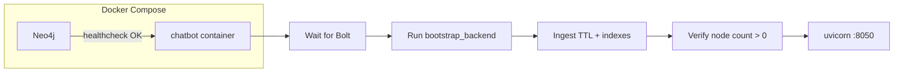
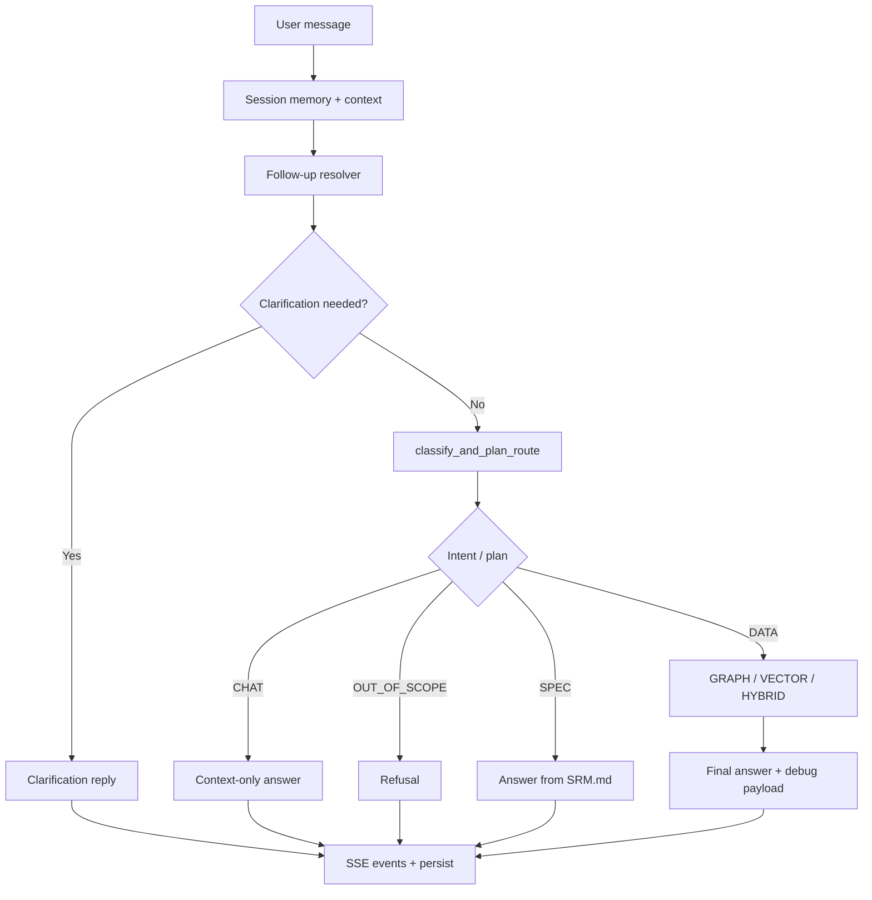
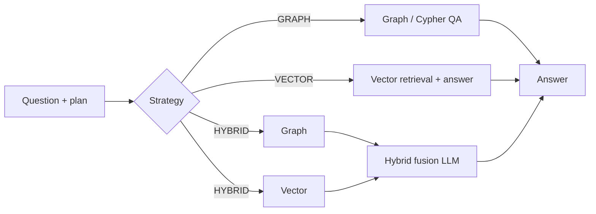

# SR-GraphRAG (SRM)

GraphRAG assistant for the SEMIC **Semantic Registry Model (SRM)**. RDF (TTL) is loaded into **Neo4j** with **n10s**; the service answers questions using **graph traversal**, **vector search**, or **hybrid** retrieval, orchestrated by LLM routing. Ships as a **FastAPI** backend (`/api/chat`) and an optional **Chainlit** app for local testing.

## Table of contents

- [Overview](#overview)
- [Features](#features)
- [Prerequisites](#prerequisites)
- [Installation](#installation)
- [Configuration](#configuration)
- [Usage](#usage)
- [Architecture](#architecture)
- [API](#api)
- [Data & ingestion](#data--ingestion)
- [Project structure](#project-structure)
- [Key entrypoints](#key-entrypoints)

---

## Overview

| Layer | Role |
|--------|------|
| **Data** | SRM TTL files → Neo4j graph + embeddings / vector indexes |
| **Runtime** | Session memory → intent + route (`GRAPH` / `VECTOR` / `HYBRID` / chat / spec) → answer + SSE events |
| **Delivery** | FastAPI on port `8050` (Docker) or your chosen port locally; Chainlit for dev UI |

Docker startup **blocks** until Neo4j is reachable, **ingestion** has run, and the graph has at least one node—only then does the HTTP API start (`Dockerfile` CMD: `bootstrap_backend && uvicorn …`).

---

## Features

- TTL ingestion via Neo4j n10s (`data_SRM.ttl`, `enriched_SRM.ttl` by default; configurable).
- LLM-driven routing: graph-only, vector-only, hybrid, conversational follow-up (`CHAT`), answers from `SRM.md` (`SPEC`), and out-of-scope handling.
- Streaming chat over **Server-Sent Events** (`/api/chat/stream`).
- Health: liveness (`/health`) and readiness with graph check (`/health/ready`).

---

## Prerequisites

- **Python** 3.12+ (see `Dockerfile` for container baseline).
- **Neo4j** 5.x with APOC + n10s (Compose in this repo wires that up).
- **LLM / embeddings** via PwC-compatible OpenAI API (`PWC_URL`, `PWC_API_KEY`) and models set in `.env`.

---

## Installation

1. **Clone / open this repo** and go to the chatbot app directory (the folder that contains `requirements.txt` and `graph_rag/`).

2. **Create a virtual environment** (recommended):

   ```bash
   python -m venv .venv
   .venv\Scripts\activate
   ```

   On macOS/Linux: `source .venv/bin/activate`

3. **Install dependencies:**

   ```bash
   pip install -r requirements.txt
   ```

4. **Configure environment:** copy or edit `.env` with Neo4j and model variables (see [Configuration](#configuration)).

5. **Start Neo4j** (or use Docker Compose so Neo4j and the app start together).

6. **Load graph data** (first time or after wiping the DB):

   ```bash
   python -m graph_rag.setup.setup
   ```

7. **Run the API** (see [Usage](#usage)).

---

## Configuration

| Variable | Purpose |
|----------|---------|
| `PWC_API_KEY`, `PWC_URL` | API key and base URL for chat + embedding calls |
| `LLM_MODEL_OPUS` | Primary model for final answers |
| `LLM_MODEL_GPT_MINI` | Faster model for routing / rewrite steps |
| `EMBEDDING_MODEL` | Embedding model name |
| `NEO4J_URI`, `NEO4J_USERNAME`, `NEO4J_PASSWORD` | Neo4j Bolt connection |
| `NEO4J_TTL_FILES` | Optional comma-separated TTL basenames (default `data_SRM.ttl,enriched_SRM.ttl`) |

Optional tuning (read in application code): `GRAPH_RAG_DEBUG_UI`, `GRAPH_RAG_MAX_CONTEXT_TOKENS`, `GRAPH_RAG_RESPONSE_RESERVE_TOKENS`, `GRAPH_RAG_RECENT_TURNS_LIMIT`.

Shared settings are loaded in `config.py` (uses `python-dotenv`).

---

## Usage

### Option A — Docker (Neo4j + chatbot)

From this directory:

```bash
docker compose up --build
```

- Neo4j: browser typically on host port mapped in `docker-compose.yml` (e.g. `7555` → 7474).
- Chatbot API: **8050** after bootstrap finishes.

### Option B — FastAPI only (local dev)

Requires Neo4j running and data ingested (`python -m graph_rag.setup.setup`).

```bash
uvicorn graph_rag.main:app --reload --host 0.0.0.0 --port 8000
```

Use this when integrating with another frontend or the semantic-registry app.

### Option C — Chainlit (interactive UI)

```bash
chainlit run graph_rag/main_chainlit.py -w
```

Chainlit uses the same chat service stack as the API for behaviour parity during development.

---

## Architecture

### Startup (Docker / production container)



### Chat request pipeline

Orchestration: `graph_rag/api/service.py`.



### Retrieval strategies (`DATA` path)



---

## API

Router prefix: `/api/chat` (`graph_rag/api/router.py`). App-level routes in `graph_rag/main.py`.

| Method | Path | Description |
|--------|------|-------------|
| `POST` | `/api/chat/session` | Create session; returns `session_id`, welcome text, suggested prompts |
| `POST` | `/api/chat` | Non-streaming JSON reply |
| `POST` | `/api/chat/stream` | SSE: `status`, `routing`, `debug`, `final`, `error` |
| `GET` | `/health` | Liveness |
| `GET` | `/health/ready` | Neo4j up + non-zero nodes |

**Quick test:** `POST /api/chat/session` → `POST /api/chat/stream` with `session_id` and `message`.

---

## Data & ingestion

| Mode | Command / behaviour |
|------|----------------------|
| **CLI** | `python -m graph_rag.setup.setup` → `KnowledgeGraphIngestion.run_ingestion()` in `graph_rag/setup/ingestion.py` |
| **Container** | `python -m graph_rag.setup.bootstrap_backend` before `uvicorn` (wait Neo4j → ingest → node count check) |

Typical pipeline: connect → n10s constraint/config → import TTL(s) → session / embedding / index steps as configured → verification.

Default TTL paths live under `graph_rag/setup/data/` (e.g. `data_SRM.ttl`, `enriched_SRM.ttl`). Compose can mount host `data` into Neo4j `import` and set `NEO4J_TTL_FILES` to match filenames there.

---

## Project structure

```text
chatbot/
├── README.md
├── requirements.txt
├── Dockerfile
├── docker-compose.yml
├── config.py                 # Env: LLM, embeddings, Neo4j
├── SRM.md                    # Reference for SPEC-style answers
├── chainlit.md
├── config.toml               # Chainlit UI config
├── .env                      # Local secrets (not committed)
├── .gitignore
├── graph_rag/
│   ├── __init__.py
│   ├── main.py               # FastAPI app + /health, /health/ready
│   ├── main_chainlit.py      # Chainlit UI entry
│   ├── prompts.py            # Runtime prompts (router, Cypher, hybrid, etc.)
│   ├── vector_search.py
│   ├── api/
│   │   ├── dto.py
│   │   ├── router.py         # /api/chat/*
│   │   └── service.py        # Orchestration + streaming
│   ├── conversation/         # Memory, resolver, token budget
│   ├── router/
│   │   ├── graph_strategy_router.py   # GRAPH / VECTOR / HYBRID
│   │   └── question_router.py         # classify_and_plan_route, SPEC/CHAT helpers
│   ├── traversal/
│   │   ├── graph_traversal.py
│   │   └── retry/
│   │       └── retry_loop.py
│   └── setup/
│       ├── bootstrap_backend.py   # Docker: wait → ingest → verify
│       ├── setup.py               # CLI ingestion entry
│       ├── ingestion.py           # Full pipeline implementation
│       ├── params.py
│       ├── prompts.py             # Setup-time prompts
│       ├── query.py               # Query test utility
│       └── data/
│           ├── data_SRM.ttl
│           └── enriched_SRM.ttl
├── translations/             # i18n JSON for Chainlit
└── data/                   # Optional local data / Neo4j import mount (compose)
```

---

## Key entrypoints

| Concern | File |
|---------|------|
| HTTP app | `graph_rag/main.py` |
| Chainlit | `graph_rag/main_chainlit.py` |
| Routes | `graph_rag/api/router.py` |
| Chat orchestration | `graph_rag/api/service.py` |
| Strategy execution | `graph_rag/router/graph_strategy_router.py` |
| Ingestion | `graph_rag/setup/setup.py`, `graph_rag/setup/ingestion.py` |
| Docker bootstrap | `graph_rag/setup/bootstrap_backend.py` |
