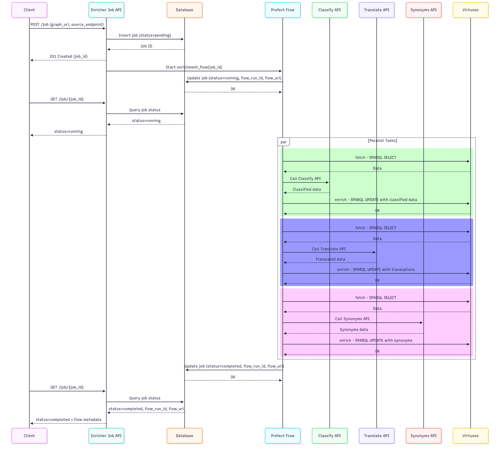
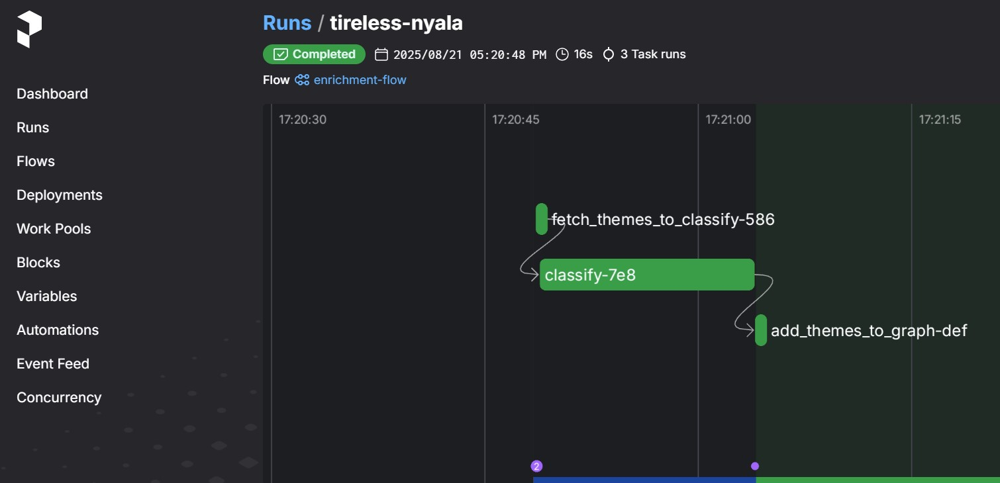
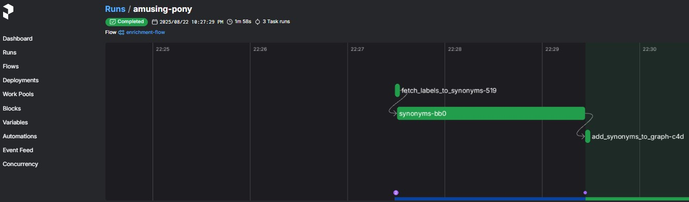
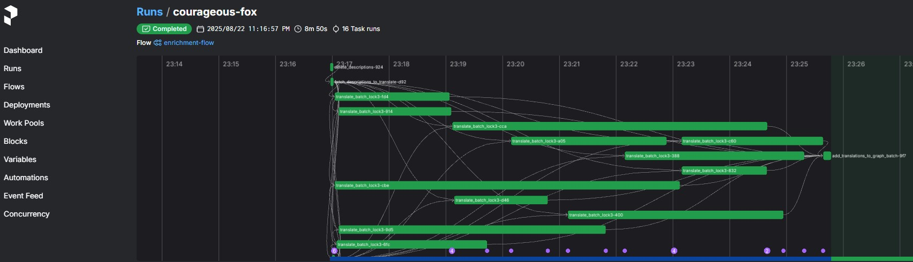

# Enricher

## Objective

The objective is to be able to find the standards in the registry.

The scope of the enricher is to enrich the data for the registry by:
- adding automatically a classification (dcat:theme) for a dct:Standard, so they can be easily found out via the classification filter
- find synonyms (skos:altLabel) for the name of the classes being part of a dct:Standard, so via synonyms classes and thefore standard can be found.
- translate the description (dct:description) of a dct:Standard in multiple languages, so end user can search in their own languages.

For more information of the model, see the [SRM](https://semiceu.github.io/uri.semic.eu-generated/SRM/releases/1.0.0/)

## Architecture

The enricher is mainly based on 2 open source software:
- [FastAPI](https://fastapi.tiangolo.com/) to trigger the Enricher Job and to execute 3 main API: classify, synonyms and translate.
- [Prefect](https://www.prefect.io/) to create a flow of 3 respective tasks (classify, synonyms and translate), that fetch the data needed from Virtuoso, calls the respective API and store the new data in Virtuoso.



## Setup

The environment is completely based on Python 3 that should be setup in the system (the version 3.11 was used for development).

Steps:
1) Pull the code and open the project with VSCode
2) From the terminal type:
   cd .\SR-dev\enricher\enricher-api\
3) create and activate the environment space:
   
  - ```python -m venv .venv```
   
  - ```& .venv/Scripts/Activate```                                                                 
4) setup the requirements:

   ```pip install -r .\requirements.txt```

5) make sure that database files are in place. The Enricher uses SQLite, via SQL Alchemy, in 2 different files:
   - enrichment_jobs.db : to store the job id executions over time, that could be used to track the execution status of the enrichment and link withe Prefect job id. The file should be present in [/enricher-api/app/v1/db/](https://github.com/SEMICeu/EU-wide-Registry-of-Semantic-Models/tree/main/SR-dev/enricher/enricher-api/app/api/v1/db) folder. Inside that folder there is create_db.py that could be executed to create the file with the command
     ```python create_db.py```
     
   - synonyms_cache.db : to store the synonyms instead of query data sources. The file should be present in [/enricher-api/app/v1/routers/synonyms](https://github.com/SEMICeu/EU-wide-Registry-of-Semantic-Models/tree/main/SR-dev/enricher/enricher-api/app/api/v1/routers/synonyms). Inside that folder there is create_db.py that could be executed to create the file with the command
  
     ```python create_db.py```

6) There are multiple configuration files:
   - [config_log.yaml](https://github.com/SEMICeu/EU-wide-Registry-of-Semantic-Models/blob/main/SR-dev/enricher/enricher-api/app/config_log.yaml) : to configure the logging of the application
   - [config_prefect.yaml](https://github.com/SEMICeu/EU-wide-Registry-of-Semantic-Models/blob/main/SR-dev/enricher/enricher-api/app/config_prefect.yaml) : to configure the behaviour of the prefect flow and tasks
   - [config_api_classify.yaml](https://github.com/SEMICeu/EU-wide-Registry-of-Semantic-Models/blob/main/SR-dev/enricher/enricher-api/app/config_api_classify.yaml) : to configure the behaviour of the api classify
   - [config_api_synonyms.yaml](https://github.com/SEMICeu/EU-wide-Registry-of-Semantic-Models/blob/main/SR-dev/enricher/enricher-api/app/config_api_synonyms.yaml) : to configure the behaviour of the api synonyms

7) Make sure you can access the Hugging face models page https://huggingface.co/models, that is used by the Enricher, via the [list_models](https://github.com/SEMICeu/EU-wide-Registry-of-Semantic-Models/blob/main/SR-dev/enricher/enricher-api/app/api/v1/mlmodels.py#L198), to download first the list of machine learning models for translation.
   The page is sometimes blocked by the company proxy and you can get the log message:
   
   {"time": "2025-08-22 22:53:47", "level": "INFO", "name": "app.api.v1.mlmodels", "message": "Fetching models from Hugging Face Hub..."}
   {"time": "2025-08-22 22:53:47", "level": "ERROR", "name": "app", "message": "Failed to preload translation pairs: Expecting value: line 1 column 1 (char 0)"}

## Execution
 
1) run the prefect server to monitor the execution:
   
   ```prefect server start```
   
   the Prefect dashboard should be accessible on http://127.0.0.1:4200
2) from the Prefect dashboard configure concurrency on task with tag "enrich" set to 5 slots, see screenshot [prefect concurrency](prefect_concurrency.jpg)
3) in VSCode, open a new terminal and launch:

    ```uvicorn app.main:app --workers 5 --log-config app/config_log.yaml```

 The idea is that the FastAPI will provide 5 parallel workers and Prefect will allocate max 5 slots of concurrency at the same time. The application will write to the app.log file.
 
 The FastAPI documentation will be available on http://127.0.0.1:8000/docs#

4) Execute the POST operation on /enricher-api/v1/job passing the parameters. The prefect flow will be triggered and it can be monitored see for example the [prefect classify task](prefect_classify_task.jpg)

### Executing classify task
The classify task is divided in 3 steps:

 1) fetch the English description of the Standard to classify from the graph in the sparql endpoint, see [query](https://github.com/SEMICeu/EU-wide-Registry-of-Semantic-Models/blob/main/SR-dev/enricher/enricher-api/app/config_prefect.yaml#L6)
 2) classify the descriptions accordingly to the Publications Office data themes, stored in the [config_api_classify.yaml](https://github.com/SEMICeu/EU-wide-Registry-of-Semantic-Models/blob/main/SR-dev/enricher/enricher-api/app/config_api_classify.yaml), calling the [classify API](https://github.com/SEMICeu/EU-wide-Registry-of-Semantic-Models/blob/main/SR-dev/enricher/enricher-api/app/config_prefect.yaml#L17)
 3) add the data themes to the graph, see [query](https://github.com/SEMICeu/EU-wide-Registry-of-Semantic-Models/blob/main/SR-dev/enricher/enricher-api/app/config_prefect.yaml#L18) 



#### Classify API

The end user can pass the below parameters:
 - a context, a sentence to be used to give a context
 - a classification, for now only the Publications Office data themes is available
 - the maximum number of results

The classify task provides to the API the below values:
 - the English description of the Standard as context
 - select the data themes classification 
 - set the maximum value 1 to be returned

To evaluate against the context, the classify API uses the sentence transformers model "[all-MiniLM-L6-v2](https://huggingface.co/sentence-transformers/all-MiniLM-L6-v2)", downloaded in the enricher-api/models folder via [load_model_mini()](https://github.com/SEMICeu/EU-wide-Registry-of-Semantic-Models/blob/main/SR-dev/enricher/enricher-api/app/api/v1/mlmodels.py#L119) function.

### Executing synonyms task
The classify task is divided in 3 steps:

 1) fetch the English description of the Standard and the English labels of classes belonging to the Standard from the graph in the sparql endpoint, see [query](https://github.com/SEMICeu/EU-wide-Registry-of-Semantic-Models/blob/main/SR-dev/enricher/enricher-api/app/config_prefect.yaml#L39)
 2) find the best synonyms for a label, if it exists, calling the [synonyms API](https://github.com/SEMICeu/EU-wide-Registry-of-Semantic-Models/blob/main/SR-dev/enricher/enricher-api/app/config_prefect.yaml#L54)
 3) add (update) the synonyms back to the graph, see [query](https://github.com/SEMICeu/EU-wide-Registry-of-Semantic-Models/blob/main/SR-dev/enricher/enricher-api/app/config_prefect.yaml#L55) 



#### Synonyms API

The synoynms API has 3 data sources to find synonyms: nltk (wordnet), altervista API and datamuse API in the respective order, see [config_api_synonyms.yaml](https://github.com/SEMICeu/EU-wide-Registry-of-Semantic-Models/blob/main/SR-dev/enricher/enricher-api/app/config_api_synonyms.yaml)
The end user can pass the below parameters:
 - a term, the text to be searched for synonyms
 - the data sources in which to search
 - a context, a sentence to be used to give a context and reorder the results in decreasing order probability
 - the maximum number of results

The synonyms task provides to the API the below values:
 - the English label of the class as term
 - the English description of the Standard as context, note that currently SRM doesn't store the description of the class
 - set the maximum value 1 to be returned

To evaluate against the context, the synonyms API uses the sentence transformers model "[all-MiniLM-L6-v2](https://huggingface.co/sentence-transformers/all-MiniLM-L6-v2)", downloaded in the enricher-api/models folder via [load_model_mini()](https://github.com/SEMICeu/EU-wide-Registry-of-Semantic-Models/blob/main/SR-dev/enricher/enricher-api/app/api/v1/mlmodels.py#L119) function.

The synonyms found for a term are stored in a cache, synonyms_cache.db see above, so the synonyms API uses the cache to retrieve the synonyms first without calling the data sources API.
The end user can get or delete the cache and look at the cache statistics from the respective API endpoints.

### Executing translate task
The classify task is divided in 5 steps:

 1) delete the translations from the graph in the sparql endpoint, see [query](https://github.com/SEMICeu/EU-wide-Registry-of-Semantic-Models/blob/main/SR-dev/enricher/enricher-api/app/config_prefect.yaml#L76)
 2) find descriptions to translate, by looking at the [language list](https://github.com/SEMICeu/EU-wide-Registry-of-Semantic-Models/blob/main/SR-dev/enricher/enricher-api/app/config_prefect.yaml#L90) finding those missing, see [query](https://github.com/SEMICeu/EU-wide-Registry-of-Semantic-Models/blob/main/SR-dev/enricher/enricher-api/app/config_prefect.yaml#L125)
 3) make batches of a certain size, defined in the [config_prefect.yaml](https://github.com/SEMICeu/EU-wide-Registry-of-Semantic-Models/blob/main/SR-dev/enricher/enricher-api/app/config_prefect.yaml), currently the size is set to 4 and there are 12 batches generated, see images below.
 4) translate the batch, calling the [translate API](https://github.com/SEMICeu/EU-wide-Registry-of-Semantic-Models/blob/main/SR-dev/enricher/enricher-api/app/config_prefect.yaml#L140) on the source description, see [query](https://github.com/SEMICeu/EU-wide-Registry-of-Semantic-Models/blob/main/SR-dev/enricher/enricher-api/app/config_prefect.yaml#L149)
 5) add translations to the graph, see [query](https://github.com/SEMICeu/EU-wide-Registry-of-Semantic-Models/blob/main/SR-dev/enricher/enricher-api/app/config_prefect.yaml#L158)



#### Translate API

The end user can pass the below parameters:
 - a term, the text to be translated
 - the source language in which of the term
 - one or multiple target languages

The translate task provides to the API the below values:
 - the description of the Standard as term
 - the source language used fo translating 
 - The target languages in which the description must be translated

The Translate API returns:
 - the detected language of the description, if the source language is not passed. The detection used the [FastText](https://fasttext.cc/docs/en/language-identification.html) model, downloaded in the enricher-api/models folder via [download_fasttext_model()](https://github.com/SEMICeu/EU-wide-Registry-of-Semantic-Models/blob/main/SR-dev/enricher/enricher-api/app/api/v2/mlmodels.py#L86) function.
 - the translations of the description in the target languages, using pair translation (source, target) opus models of the [Helsinki-NLP](https://huggingface.co/models?sort=trending&search=Helsinki-NLP) downloaded in the enricher-api/models.

The [config_prefect.yaml](https://github.com/SEMICeu/EU-wide-Registry-of-Semantic-Models/blob/main/SR-dev/enricher/enricher-api/app/config_prefect.yaml) includes the list of languages and the prioritised list of pivot languages.
The pivot languages are used to:
- prioritize on the language used for translation, if a standard is in Italian and English but must be translated in French, the English description (first in the list of the pivot languages) is used to translate to French, by doing En->Fr translation.
- optimize memory and and disk, so instead of downloading the pair model It->Fr, the En->Fr is downloaded instead as privileged
- in case of missing direct translation, the pivot list is used to choose the first pivot available in which a direct translation is missing. That is the current case of not being able to translate from English to Polish, so the next available pivot is chosen that is French which has direct translation, therefore English description is translated in French, which in turn is translated in Polish.

Note that the opus pairs have a limit on the input text, therefore, in the translate API v2 currently used, the input text is split in sentences and, if the sentence is too long, is split in 400 characters.

## Debug

1) Check executions of the tasks on the Prefect dashboard
2) Monitor the app.log file, it could be also monitored/analysed with streamlit with the command:

   ```streamlit run log_dashboard.py```

Notes:
1) if you stop the execution from the VSCode terminal, while it is executing the Prefect tasks, make sure that there aren't active tasks in the concurrency with the command:

   ```prefect concurrency-limit inspect enrich```
   
   if you see active tasks better reset via the command:

   ```prefect concurrency-limit reset enrich```

2) Sometimes in the app.log you see warnings on concurrency of sqlite, these are internal warnings of Prefect that you can ignore.

## TO DO

1) Add more languages for translating. In the [config_prefect.yaml](https://github.com/SEMICeu/EU-wide-Registry-of-Semantic-Models/blob/main/SR-dev/enricher/enricher-api/app/config_prefect.yaml) there is:
  - the [language list](https://github.com/SEMICeu/EU-wide-Registry-of-Semantic-Models/blob/main/SR-dev/enricher/enricher-api/app/config_prefect.yaml#L90), to indicate the 10 languages tested so far 
  - the [translate_additional_languages](https://github.com/SEMICeu/EU-wide-Registry-of-Semantic-Models/blob/main/SR-dev/enricher/enricher-api/app/config_prefect.yaml#L101), to indicate the potential languages to be moved in the language list and tested.

2) Test better the all-MiniLM-L6-v2 model if it is good for the classify API or choose the best synonym in the synonyms API.

3) Run the enricher whenever a description changes; for now the enricher is thought to add (classify, synonyms, translate) in one shot but ideally it should run when a new standard is modified. 

4) Move in the configuration file:
 - the Prefect and task tags (like "enrich" and retry) 
 - the synonyms cache expiration now set to 24 hours 
 - the translate max characters (now 400)

5) Evaluate performance for translating; for now the batch size is 4 and the multi target is True (so using the multi target feature of the Translate API) but it would be nice to see if there are better combination.

6) Evaluate performance for synonyms; now synonyms are found in a loop, maybe it is possible to split in batch.


