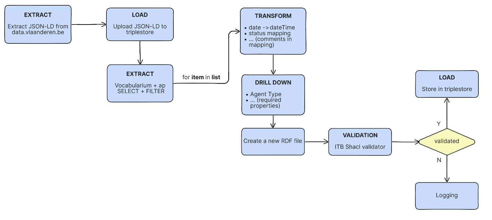

# Harvester

## Objective

This tool collects semantic assets from EU member states and loads them into the semantic registry through an ETL pipeline.

The pipeline currently harvests from:
- **Flanders Register**: https://data.vlaanderen.be/standaarden/
- **Italy**: https://schema.gov.it/
- **Norway**: https://data.norge.no/

For more information about the data model, see the [Semantic Registry Model (SRM)](https://semiceu.github.io/uri.semic.eu-generated/SRM/releases/1.0.0/).

## Architecture

### ETL Pipeline

The pipeline executes the following steps:

1. **Extract** source triples from the member state (implementation varies by member state depending on data exposure)
2. **Load** source triples into the triple store
3. **Transform** triples to conform to the Semantic Registry Model (implementation varies by member state depending on their data model)
4. **Validate** triples using the ITB-SHACL validator
5. **Load** validated triples into the semantic registry

While the ETL pipeline follows consistent steps across different sources, the extraction and transformation phases are customized for each member state based on how their data is exposed and modeled.

**Example: Flanders ETL Flow**



### Technology Stack

The harvester is built on three core open-source technologies:

- **[GraphDB](https://www.ontotext.com/products/graphdb/)**: Stores extracted triples from input sources
- **[Prefect](https://www.prefect.io/)**: Orchestrates workflow execution, running predefined ETL tasks in parallel
- **[ITB-Shacl-validator](https://www.itb.ec.europa.eu/shacl/srm/upload)**: SHACL Validator from the Interoperability Test Bed, This service allows you to validate arbitrary RDF content against SHACL shapes


## Setup

The environment is completely based on Python 3.12 (or higher). Ensure Python is installed on your system before proceeding.

### Initial Setup

1. Clone the repository and open the project in your IDE of choice (VSCode recommended)

### GraphDB

1. Start the GraphDB container using Docker Compose:
```bash
   docker compose -f 'SR-dev/harvester/docker-compose.yml' up -d --build
```

2. Verify GraphDB is running and you have authorization to create repositories:

   http://localhost:7200/

### ITB-SHACL Validator

1. Navigate to the validator directory from the project root:
```bash
   cd SR-dev/validator/
```

2. Start the ITB-SHACL validator:
```bash
   java -Dvalidator.resourceRoot=./resources -Dlogging.file.path=./logs -Dvalidator.tmpFolder=./tmp -jar validator.jar
```

   **Note:** The validator currently runs locally. Future updates will integrate with the hosted validator at https://www.itb.ec.europa.eu/shacl/srm/upload

### Harvester execution

The following steps demonstrate how to run the harvester using Flanders as an example.

**Prerequisites:** Ensure both the GraphDB container and ITB-SHACL validator are running before proceeding.


1. Create and activate the virtual environment:
```bash
   python -m venv .venv
```
```bash
   .venv/Scripts/Activate.ps1
```

2. Install the required dependencies:
```bash
   pip install -r requirements.txt
```

3. Start the Prefect server:
```bash
   prefect server start
```

   **Note:** The Prefect dashboard will be accessible at http://127.0.0.1:4200

4. Open a new terminal and navigate to the SR-dev directory:
```bash
   cd SR-dev
```

5. Run the Flanders harvester flow:
```bash
   python -m harvester.member_states.flanders.flow
```
**Note:** You can adjust the number of concurrent workers by modifying the `max_workers` parameter on line 16 of the flow configuration file:

`SR-dev/harvester/member_states/flanders/flow.py`
```python
@flow(name="Parallel Processing Pipeline", task_runner=ConcurrentTaskRunner(max_workers=5))
```

6. Monitor the pipeline execution in the Prefect dashboard:

   http://127.0.0.1:4200/runs

   [prefext_flow](prefect_flow.png)

## Confifuration files

There are multiple configuration files:

   - [config.yaml](https://github.com/SEMICeu/EU-wide-Registry-of-Semantic-Models/blob/main/SR-dev/enricher/enricher-api/app/config_log.yaml) : Contains all the reusable variables, such as, endpoints, queries, namespaces, etc
   - [config_graphDB_repo.ttl](https://github.com/SEMICeu/EU-wide-Registry-of-Semantic-Models/blob/main/SR-dev/harvester/member_states/flanders/config_graphDB_repo.ttl) : for creating and deleting a GraphDB repository
   - [config.properties (validator)](https://github.com/SEMICeu/EU-wide-Registry-of-Semantic-Models/blob/main/SR-dev/validator/resources/srm/config.properties) : to configure the local ITB-Shacl validator

## Provenance

The harvester includes two provenance tracking mechanisms located in `SR-dev/harvester/provenance`:

### Provenance Adapters

- **Prefect Artifacts** (`SR-dev/harvester/provenance/adapters/prefect_adapter.py`): 
  Custom artifacts integrated with Prefect, visible in the "Artifacts" tab of the Prefect dashboard for monitoring pipeline execution metadata.

- **Graph RDF** (`SR-dev/harvester/provenance/adapters/graph_adapter.py`): 
  Generates an RDF file containing complete provenance information about the harvesting process.